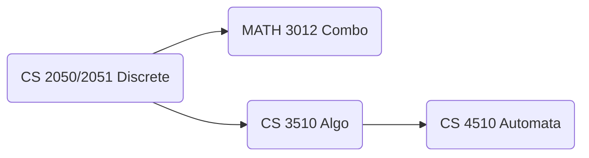

# CS2050 Discrete Mathematics -- Overleaf Help

Welcome to Georgia Tech's CS2050 Discrete Mathematics! 

While not necessary, learning `LaTeX` at this point of your degree can be incredibly helpful later on down the road when courses get more difficult. Some courses require or give incentives for doing projects and assignments in LaTeX, and other situations may find a use for it such as for making resumes or if you wish to pursue academia in the future! 

**_In the case of 2050, to encourage you to learn, we offer a slight bonus for typeset homework submissions (Spring 2024)._**

Some courses known to sometimes require or encourage LaTeX or a form of typed submission:
- CS 3510 Design and Analysis of Algorithms (2050's sucessor course)
- CS 4510 Automata and Complexity
- MATH 3012 Combinatorics
- Many MANY upper level courses in the MATH department (looking at you Theory threads)

While this repo won't cover EVERYTHING, we'll provide some basic templates and methods to structure documents to get you started.

As always, if you have any questions or run into an errors, feel free to reach out on Ed Discussion (or course equivalent).

 
<h3><i>

 - the CS2050 TAs :) 

<i/><h3/>
