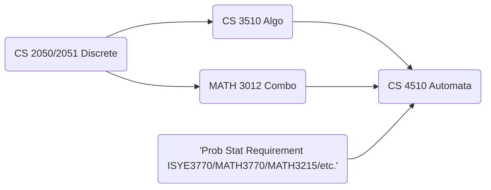

# CS2050 Discrete Mathematics -- LaTeX Help

Welcome to Georgia Tech's CS2050 Discrete Mathematics! 

For those that aren't aware of what `LaTeX` is, it's basically a way to code your own documents but with methods that make formatting tables, equations, etc. much much easier and more elegantly. 

While not necessary, learning `LaTeX` at this point of your degree can be incredibly helpful later on down the road when courses get more difficult. Some courses require or provide incentives for submitting projects and assignments in `LaTeX`, and other situations may find a use for it such as for making resumes or if you wish to pursue academia in the future! 

`LaTeX` usage can also appear in a lot of other environments. GradeScope textbox questions allow you to type `Markdown` and `LaTeX` inside. For latex, you can surround your equations with triple equal signs (e.g. `$$$\frac{a}{b}$$$`). This also allows you to insert tables, matricies, bold text, coloured text, etc. into GradeScope if you're so inclined for the fun of it. Ed discussion also allows you to use `markdown` codeblocks and `LaTeX` which can make asking questions and communicating easier. 
<!-- Insert a new page for benefits and other applications? -->

> **_In the case of 2050, to encourage you to learn, we offer a slight bonus for typeset homework submissions (Spring 2024)._**

Some courses known to sometimes require or encourage LaTeX or a form of typed submission:
- CS 3510 Design and Analysis of Algorithms (2050's sucessor course)
- CS 4510 Automata and Complexity
- MATH 3012 Combinatorics
- Prob-Stat Requirement
- Many MANY upper level courses in the MATH department (looking at you Theory threads)

**Prereq order for these...**

While this repo won't cover EVERYTHING, we'll provide some basic templates and methods to structure documents to get you started.

> If you're first getting started, we recommend using the [Overleaf](https://www.overleaf.com/) editor but any will suffice. All we see in the end is the exported PDF after all. :\)

_Note: we've found that some packages present in the provided `.tex` homework file are incompatible with some compilers/editors. So if you're using the file we provide, it's strongly suggest that you use Overleaf._

 

As always, if you have any questions or run into an errors, feel free to reach out on Ed Discussion (or course equivalent).

 
<h3><i>

 - the CS2050 TAs :) 

</i></h3>
 

   

# Guide to the Guide
If you're unsure where to begin, here's a list of pages you should view in order:
- Setting up overleaf
...

 

# Repo Table of Contents
## Completed Pages
- [Templates](templates)
	- [Homework Template.tex](templates/homework_template.tex)
- [Tutorials](tutorials)
	- [Tables using Tabular](tutorials/tables.md)
	- [Tables \(Multipage\) using Longtable](tutorials/multi-page%20tables.md)
	- [Font Size](tutorials/font%20size.md)

## IP
- [Font Colour](tutorials/font%20colour.md)
- [Setting Up Overleaf](tutorials/setting%20up%20overleaf.md)
- Making things fit
- Solution box -- colour change?

<!-- Add parent files to link font size, colour, etc. together to explain different options e.g. if table is too big -->
