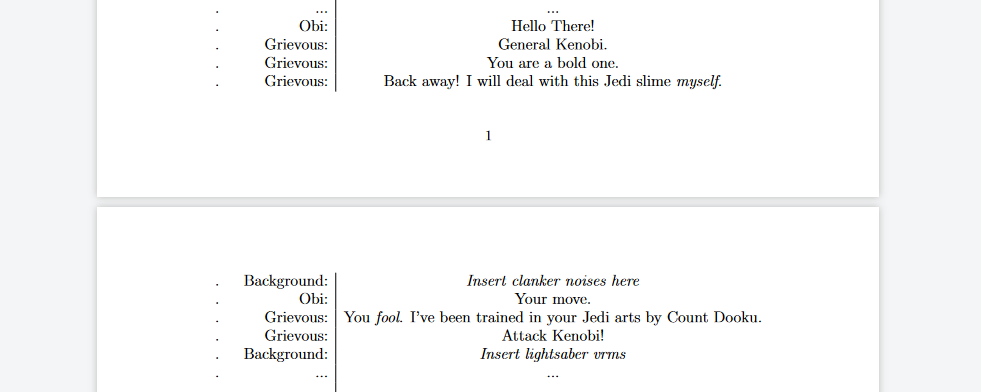

# Multi-Page Tables -- Using `Longtable`
<!-- ${{\color{gray}\textnormal{Click here for a regular table\:}}}$ _[link](tables.md)_ -->

_[Click here for regular tables (`tabular`)](tables.md)_


## Implementation

If you want a table to spill onto a new line vertically while maintaining the previous appearance (e.g. column widths, center, etc.), you can use the package `longtable`.


At the top with the rest of the packages, make sure to have longtable imported.
```latex
\usepackage{longtable}
```

Besides that, the useage is extremly similar to `tabular`.

```latex
\begin{longtable}{rc|c}
    \# & \textbf{Statement} & \textbf{Reason} \\
    \hline
    
    1. & insert statement & insert reason \\
    2. & ... & ... \\
    .  & ... & ... \\
    .  & ... & ... \\
    .  & ... & ... \\
\end{longtable}
```

`{rc|c}` means right-alight, centre, separating line, centre for the columns, just like with `tabular`.

I usually have the `rc|c` structure so I have a column for the numbering lines 1, 2, 3...

> Note: `longtable` will auto-centre the table in the page to ensure that the table lines up with a new page when it spills over. Tabular will not and just cut.

## Example

Here's some code. If say the following where to involve going over the end of one page, this would be the correspondig output...
```latex
\begin{longtable}{lr|c}
   \# & \textbf{Statement} & \textbf{Reason} \\
   \hline
   
   1. & statement   & reason \\
   .  & ...         & ... \\
   .  & Obi:        & Hello There! \\
   .  & Grievous:   & General Kenobi. \\
   .  & Grievous:   & You are a bold one. \\
   .  & Grievous:   & Back away! I will deal with this Jedi slime \textit{myself}. \\
   .  & Background: & \textit{Insert clanker noises here} \\ 
   .  & Obi:        & Your move. \\
   .  & Grievous:   & You \textit{fool}. I've been trained in your Jedi arts by Count Dooku. \\
   .  & Grievous:   & Attack Kenobi! \\
   .  & Background: & \textit{Insert lightsaber vrms} \\
   .  & ...         & ... \\
\end{longtable}

```




</br>

## `Tabular` vs `Longtable`
_[Click here for `tabular`](tables.md)_

Here are the two side by side to see the differences. As you can see, it's not that much. The implementations besides the initial `\usepackage{}` and `\begin{}` header are identical. 

<p align="center">
<table>
   <tr>
      <th>Tabular</th>
      <th>Longtable</th>
   </tr>

   
   <tr>
   <td>
   
   ```latex
   % no package to import


   % ...

   \begin{tabular}{rc|c}
      \# & \textbf{Statement} & \textbf{Reason} \\
      \hline

      1.  & statement & reason \\
      2.  & ... & ... \\
      .   & ... & ... \\
      .   & ... & ... \\
      .   & ... & ... \\
   \end{tabular}
   ```
   </td>

   <td>

   ```latex
   % make sure this is at the top
   \usepackage{longtable}
   
   % ...

   \begin{longtable}[c]{rc|c}
      \# & \textbf{Statement} & \textbf{Reason} \\
      \hline
      
      1. & statement & reason \\
      2. & ... & ... \\
      .  & ... & ... \\
      .  & ... & ... \\
      .  & ... & ... \\
   \end{longtable}
   ```

   </td>
   </tr>


   <tr>
      <td width="50%"></td>
      <td width="50%"></td>
      
   </tr>
</table>
</p>

*They look the **exact** same. :p*


<!-- ## Example

```latex
this

```
would yield this:
*insert image -->
