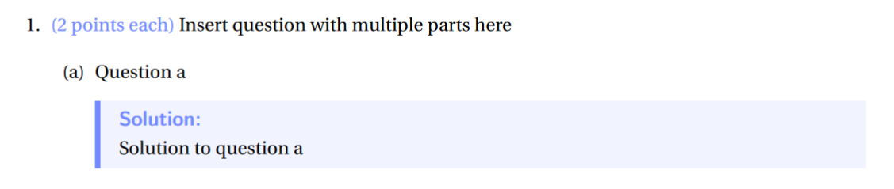

# Solution Box
In the file we provide, you can use our built-in solution box to highlight what your answer is. 

*From our template:*



</br>
</br>

To use this, just wrap your answer with this statement
```latex
\begin{solution}
    Insert your solution here as per usual
\end{solution}
```


You're still able to use whatever additional methods you like to use, making your answer as complicated as possible. Tables, formulas, blocks of text -- it's all fair game.

```latex


```